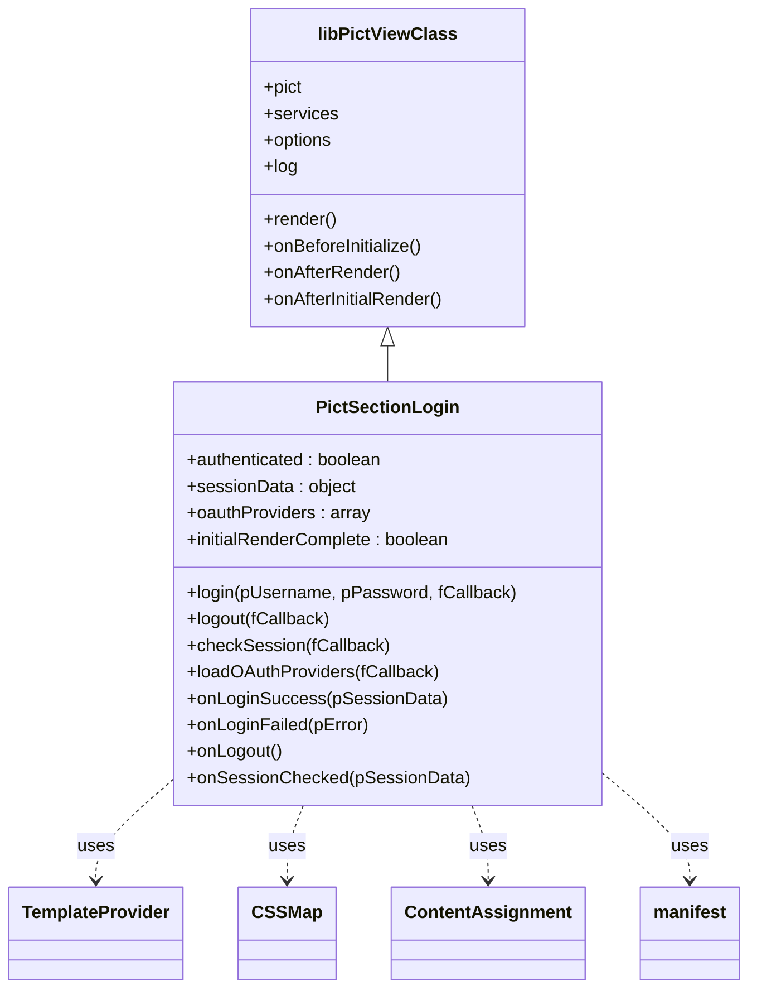
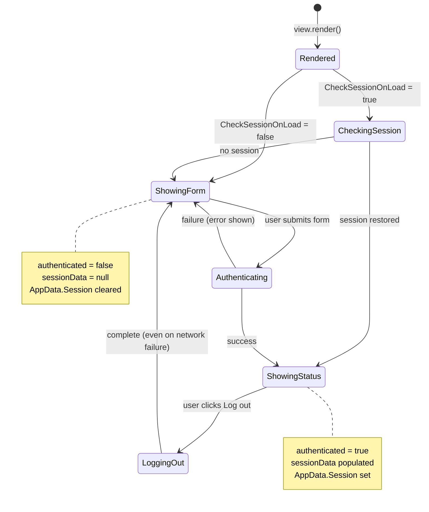

# Architecture

Pict Section Login is a single `pict-view` subclass that owns its own templates, CSS, state, and auth request logic. It leans on the standard Pict services (TemplateProvider, CSSMap, ContentAssignment, manifest) for rendering and state storage, and exposes four override hooks that let the host application react to auth state changes.

## Component Map

<!-- bespoke diagram: edit diagrams/component-map.mmd or .hints.json, then: npx pict-renderer-graph build modules/pict/pict-section-login/docs -->


## Class Hierarchy



## Auth State Machine



## Login Request Flow

<!-- bespoke diagram: edit diagrams/login-request-flow.mmd or .hints.json, then: npx pict-renderer-graph build modules/pict/pict-section-login/docs -->


## Initial Render Flow

<!-- bespoke diagram: edit diagrams/initial-render-flow.mmd or .hints.json, then: npx pict-renderer-graph build modules/pict/pict-section-login/docs -->


## State Members

`PictSectionLogin` carries a small amount of instance state:

| Member | Type | Description |
|---|---|---|
| `this.authenticated` | `boolean` | Whether a session is currently active. `true` after a successful `login` or `checkSession`. |
| `this.sessionData` | `object \| null` | The most recent session object returned from the backend. Mirrored to `options.SessionDataAddress`. |
| `this.oauthProviders` | `array` | The provider list fetched from `OAuthProvidersEndpoint`. Empty until `loadOAuthProviders` completes. |
| `this.initialRenderComplete` | `boolean` | Internal flag; `true` after `onAfterInitialRender` has run once. |

## Session Data Shape

The view treats the backend response as opaque except for a few keys:

| Key | Purpose |
|---|---|
| `LoggedIn` | Required. `true` means authenticated, anything else is treated as a failure. |
| `UserID` | Displayed in the status bar. |
| `UserRecord` | Optional object; `UserRecord.FullName` / `UserRecord.LoginID` are displayed. |

Any other fields are preserved verbatim in `this.sessionData` and at `SessionDataAddress`. You can include roles, feature flags, tenant ids, or anything else your backend returns.

## File Layout

```
pict-section-login/
├── README.md
├── package.json
├── source/
│   ├── Pict-Section-Login.js                     # main class
│   └── Pict-Section-Login-DefaultConfiguration.js # templates + CSS + defaults
├── test/
│   ├── Pict-Section-Login_tests.js               # Mocha TDD unit tests
│   └── Browser_Integration_tests.js              # Puppeteer headless tests
├── example_applications/
│   ├── orator_login/                             # minimal orator-authentication
│   ├── custom_login/                             # custom endpoints + hooks
│   ├── oauth_login/                              # OAuth providers
│   └── harness_app/                              # full login + router app
└── docs/
	├── README.md, _cover.md, _sidebar.md, _topbar.md
	├── quickstart.md
	├── architecture.md
	├── configuration.md
	├── api-reference.md
	├── code-snippets.md
	├── embedding-guide.md
	├── router-integration.md
	└── templates-and-styling.md
```

## Session Storage Policy

The view does not store tokens in `localStorage`, `sessionStorage`, or any browser storage. The backend is assumed to maintain the session via HTTP-only cookies (or any other credentialed mechanism that the browser carries automatically), and the view verifies that session via `CheckSessionEndpoint` on load.

Consequences:

- Refreshing the page works transparently if cookies are set correctly -- `checkSession` restores the session.
- XSS in the host application cannot steal tokens from storage because there are none.
- Cross-tab behavior is consistent -- both tabs see the same server-side session.
- Logging out in one tab does not automatically log out in another; call `checkSession` periodically if you need cross-tab coordination.
